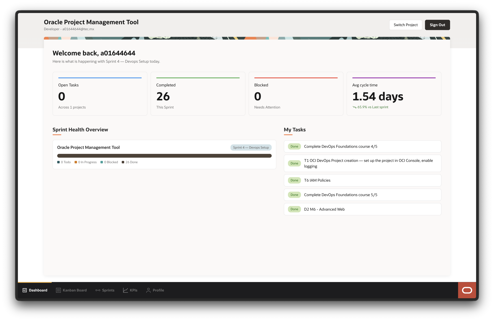
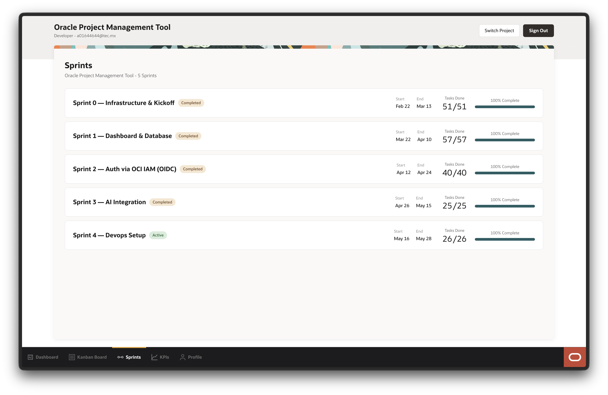
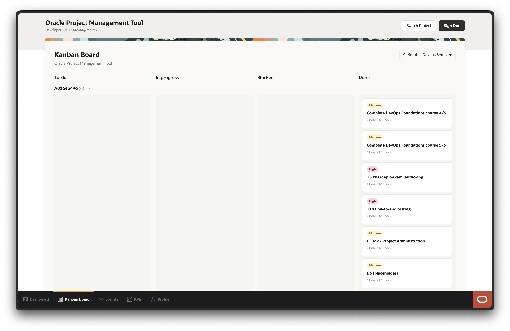
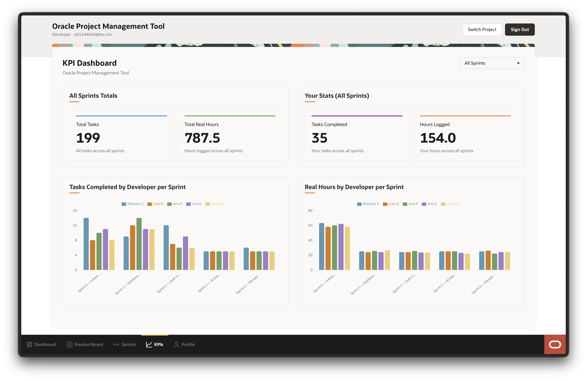
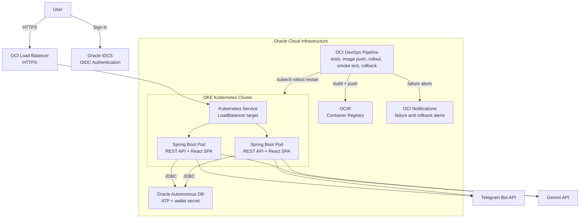

# Oracle PM Tool

Oracle PM Tool is a cloud-native project management platform built for Oracle teams. It helps teams plan projects, manage sprints, move tasks across Kanban workflows, log developer hours, and track delivery KPIs from a single authenticated web app.

The project is implemented as a Spring Boot monolith that serves both the REST API and a React single-page app. It is deployed to Oracle Cloud Infrastructure using OCI DevOps, OCIR, OKE, Oracle Autonomous Database, Kubernetes health checks, automated tests, deployment smoke tests, OCI Notifications, and automatic rollback.

## Screenshots

### Dashboard



### Sprint Board



### Developer Workload Kanban



### KPI Dashboard



## Features

- Project, sprint, task, member, invitation, and work-log management.
- Drag-and-drop sprint board built with React, MUI, React Query, and dnd-kit.
- Developer workload Kanban grouped by assignee with collapsible rows.
- KPI dashboard for cycle time, scope creep, blocker resolution, rework, completed tasks, and developer hours.
- Oracle IDCS OIDC authentication for the React app and protected backend API routes.
- Telegram bot integration for creating, updating, listing, and reporting on tasks.
- Gemini integration for natural-language task parsing and semantic task/sprint resolution.
- Oracle Database triggers for task timestamps, state history, assignment history, and rework tracking.

## Architecture



The backend is a Java 17 Spring Boot application with Hibernate/JPA repositories, REST controllers, Telegram bot services, Gemini API integration, and Oracle JDBC connectivity. The frontend is a React 18 app using React Router, React Query, MUI, dnd-kit, Recharts, and OIDC client libraries.

The React production build is generated by `frontend-maven-plugin` during Maven packaging and copied into the Spring Boot JAR, so the deployed container serves the API and SPA from one artifact.

## Reliability and DevOps

The deployment pipeline is designed to fail early, verify the deployed app, notify on failure, and roll back automatically when a release is unhealthy.

- OCI DevOps build pipeline installs Java 17, runs automated tests, packages the app, builds a Docker image, pushes to OCIR, and restarts the OKE deployment.
- Backend tests run with Maven and frontend checks run with ESLint and Jest in CI mode.
- Spring Boot Actuator exposes `/actuator/health/readiness` and `/actuator/health/liveness`.
- Kubernetes readiness and liveness probes keep unhealthy pods out of service and restart stuck containers.
- Post-deploy smoke tests call the public readiness endpoint with retries to avoid false failures during Load Balancer propagation.
- OCI Notifications publishes alerts when tests, packaging, image publishing, rollout, smoke tests, or rollback fail.
- Automatic rollback uses `kubectl rollout undo` when the Kubernetes rollout or smoke test fails.

## Tech Stack

| Layer | Technologies |
| --- | --- |
| Frontend | React 18, MUI v5, React Query, React Router, dnd-kit, Recharts, Axios |
| Backend | Java 17, Spring Boot, Spring Security, Hibernate/JPA, Oracle JDBC, Lombok |
| Database | Oracle Autonomous Transaction Processing, Oracle 26ai, SQL triggers |
| Integrations | Oracle IDCS OIDC, Telegram Bot API, Gemini API |
| DevOps | OCI DevOps, OKE, OCIR, Kubernetes, Docker, Maven, Jest, ESLint |

## Repository Layout

```text
MtdrSpring/backend/
  src/main/java/                         Spring Boot API, services, models, repositories
  src/main/frontend/                     React application
  src/test/java/                         Backend tests
  Dockerfile                             Runtime image

k8s/
  deploy.yaml                            OKE Deployment and LoadBalancer Service
  rollback-deployment.sh                 Manual rollback helper

schema/
  schema.sql                             Database schema
  triggers.sql                           Oracle triggers and app context package

architecture/
  workspace.dsl                          Architecture model
```
